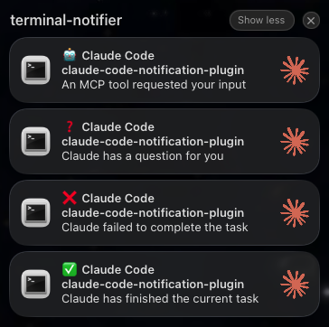

# claude-code-notification-plugin

Claude Code plugin to enable desktop notifications.

## Features

- Display Desktop notifications for the following events:
  - ✅ Claude has finished the current task (`Stop`)
  - ❌ Claude failed to complete the task (`StopFailure`)
  - ❓ Claude has a question for you (`PermissionRequest`)
  - 🤖 An MCP tool requested your input (`Elicitation`)
- Notifications are delayed 60 seconds and cancelled automatically if Claude resumes work before they fire, so you're only notified when Claude is actually idle.

### Screenshots



## Supported Platforms

- **macOS** — uses [`terminal-notifier`](https://github.com/julienXX/terminal-notifier). Clicking a notification focuses the terminal that launched the Claude session; repeated events for the same session replace each other instead of stacking.
- **Linux** — uses `notify-send` via [libnotify](https://gitlab.gnome.org/GNOME/libnotify)

## Dependencies

- [`jq`](https://stedolan.github.io/jq/) — used to parse hook input.

### macOS

Install `terminal-notifier`:

```sh
brew install terminal-notifier
```

On first use, macOS will silently drop notifications until you enable them. Open **System Settings → Notifications → terminal-notifier** and allow banners.

### Linux

Install `libnotify` to get `notify-send`:

```sh
# Debian/Ubuntu
sudo apt install libnotify-bin

# Arch/Manjaro
sudo pacman -S libnotify

# Fedora
sudo dnf install libnotify
```

## Installation

From within Claude Code, add the marketplace and install the plugin:

```
/plugin marketplace add paulodiovani/claude-code-notification-plugin
/plugin install notification@paulodiovani
```
